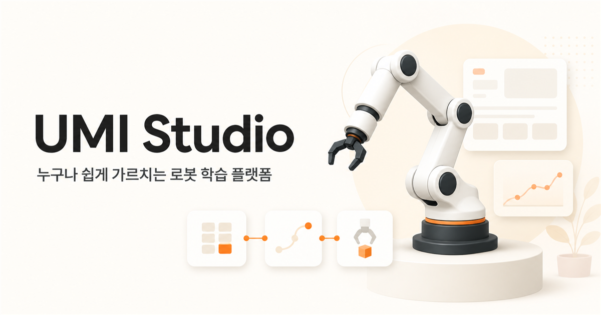

# Physical AI Robot Learning Platform

**로봇 전문가가 아니어도 시연을 모아 동작을 학습시키고, 웹에서 작업을 구성해 실행할 수 있도록 만든 플랫폼**의 프론트엔드와 AI 개발 기록입니다. 스마트폰을 장착한 UMI 장치로 작업을 보여주고, 수집한 영상으로 로봇 정책의 입력 데이터를 만듭니다.



## 사용 흐름

1. UMI로 작업 공간을 촬영하고 사람의 시연을 수집합니다.
2. Mapping 영상으로 ORB-SLAM3 Atlas를 만들고, 시연별 카메라 움직임을 복원합니다.
3. ArUco 기준 좌표 정렬과 추적·시간·그리퍼 품질 검사를 거쳐 학습용 데이터를 구성합니다.
4. GPU에서 정책을 학습하고 예측·영상 반응·실행 가능성을 평가합니다.
5. 웹에서 데이터와 학습 상태를 확인하고, 학습 동작을 작업 블록과 조합합니다.

## 공개한 코드

| 경로 | 내용 | 작성 범위 |
|---|---|---|
| [`FE/`](FE/) | 랜딩·로그인, 대시보드, 데이터·학습·작업·장치 화면, API 연동, 반응형 UI | 최종 프론트엔드 **기능 소스 전체**. 황도경의 설계·구현 이후 다른 구성원의 연동·수정도 포함 |
| [`AI/`](AI/) | ORB-SLAM3 정렬, 상대 동작 데이터 계약·변환, BC 기준선, 평가·시뮬레이션 도구 | 황도경 작성 코드와 팀의 AI 코드가 함께 있음 |
| [`training_bundle/`](training_bundle/) | 로컬 인계본의 UMI 데이터셋 빌더와 Stanford UMI 연동 트레이너 | 팀 인계 코드. 개인 구현으로 표시하지 않음 |
| [`BE/GPU_/umi_server_preprocessor/`](BE/GPU_/umi_server_preprocessor/) | RAW→Atlas→UMI Zarr 전처리 서비스 | 팀의 서버 인계 코드 |
| [`BE/GPU_/FastAPI_/`](BE/GPU_/FastAPI_/) | 학습 요청, 공식 UMI 트레이너 호출, 진행률·체크포인트 패키지 처리 | 팀의 GPU 학습 서비스 코드 |

공개용 사본에서는 원래 기관 이름과 로고를 일반 브랜드인 **UMI Studio**로 바꾸고 내부 협업 문서를 제외했습니다. 화면 기능과 학습 경로의 소스 구조는 유지했습니다. 원본 저장소의 GitLab 커밋 이력은 이 저장소에 복사하지 않았습니다.

## AI 파이프라인과 재현 범위

```text
UMI RAW + Mapping 영상
  → ORB-SLAM3 Atlas · 시연별 localization
  → ArUco 좌표 정렬 · pose/gripper 품질 검사
  → 상대 동작 v10 데이터 · 공식 UMI Zarr
  → GPU 학습 어댑터 → 팀 트레이너 → 외부 Stanford UMI 워크스페이스 → 체크포인트
  → 예측·시뮬레이션·실행 전 검사
```

이 저장소에는 [Atlas·v10 변환 도구](AI/tools/build_orbslam_umi_relative_dataset.py), [UMI Zarr 변환 도구](AI/tools/convert_v10_to_umi.py), [GPU 학습 어댑터](BE/GPU_/FastAPI_/app/trainer/training_adapter.py), [로컬 인계본의 팀 트레이너](training_bundle/03_umi_policy_trainer/train_policy.py), [상대 동작 BC 실험 코드](AI/tools/train_relative_chunk_bc.py)가 들어 있습니다. 트레이너 본체는 GitLab `master` 추적 파일에는 없었지만 노트북의 프로젝트 인계 폴더에서 확인해 포함했습니다. **Stanford UMI 원본 워크스페이스와 ORB-SLAM3 실행 파일·vocabulary는 별도로 필요합니다.** 따라서 이 저장소만으로 RAW부터 정책 체크포인트까지 즉시 재현할 수는 없습니다. [AI 구성 설명](AI/README.md)에 각 단계의 입력과 외부 의존성을 정리했습니다.

원본 시연·개인 공간 영상, Atlas 파일, 생성 데이터셋, 모델 가중치와 운영 환경값은 포함하지 않았습니다. 실험의 검증 손실이나 개루프 예측 오차는 실물 로봇의 성공률이 아닙니다.

## 황도경의 기여

- **로고와 프론트엔드:** 로고 제작에서 시작해 비전문가를 위한 화면 흐름·와이어프레임·목업을 설계했습니다. 랜딩·로그인, 대시보드, 데이터·학습·작업·장치 화면과 반응형 UI를 구현하고, 튜토리얼과 단계별 상태 안내를 다듬었습니다.
- **UMI 데이터 처리:** 전달받은 RAW와 Mapping 영상을 ORB-SLAM3 Atlas로 처리하고 ArUco 좌표 정렬, 시연별 pose·그리퍼 간격 복원, 품질 선별과 학습용 v10 데이터 구성을 진행했습니다. 92편을 처리해 74편의 기준 묶음을 만들고 학습 담당자에게 인계했습니다.
- **개인 AI 실험:** 상대 동작 청크의 BC 기준선과 공간 인코더 대조, 홀드아웃 영상 반응·MuJoCo·실행 전 검사를 위한 코드를 작성했습니다.

UMI 정책의 **120 epoch 학습 실행은 다른 AI 구성원의 작업**입니다. 팀 코드와 개인 기여의 근거는 [기여 상세](CONTRIBUTIONS.md)에 구분했습니다.

## 프론트엔드 실행

Node.js 22.13 이상과 pnpm 11이 필요합니다.

```bash
cd FE
pnpm install --frozen-lockfile
pnpm dev
```

기본 주소는 `http://localhost:3000`입니다. 로그인·데이터·학습 API를 실제로 사용하려면 별도 백엔드가 필요합니다. `NEXT_PUBLIC_API_BASE_URL` 기본값은 `http://localhost:8080/api/v1`입니다. 자세한 화면 기능은 [FE 설명](FE/README.md)에 있습니다.

## 출처와 사용 범위

이 공개본은 별도의 소스 사본이며 개인 계정의 GitLab 작성 이력과 팀 작업 기록을 바탕으로 기여를 구분했습니다. 코드와 자산의 개인 GitHub 게시 권한은 저장소 소유자가 확인했습니다. 이 저장소 전체에 단일 오픈소스 라이선스를 부여하지 않습니다. 외부 ORB-SLAM3·UMI 코드와 로봇 형상은 별도 출처·라이선스가 적용됩니다.
